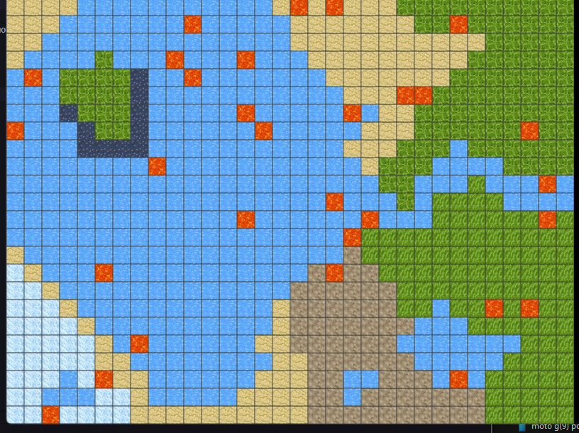
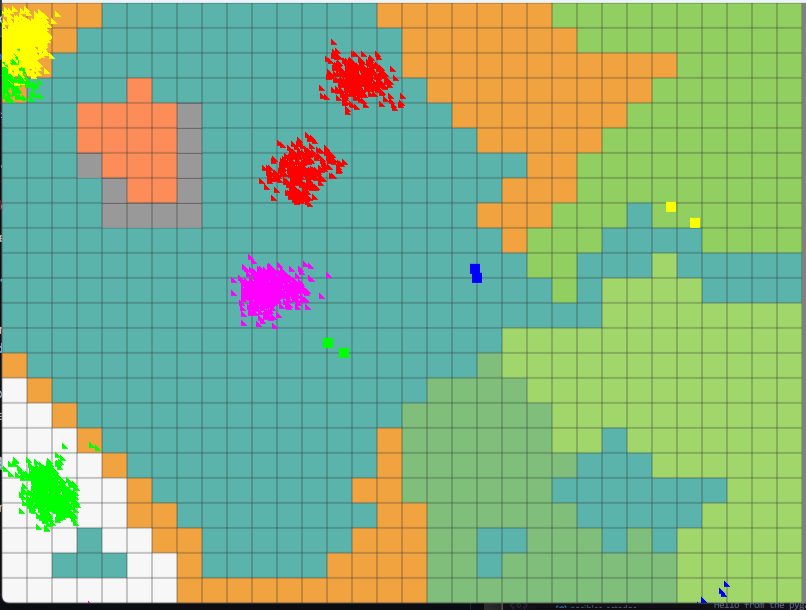
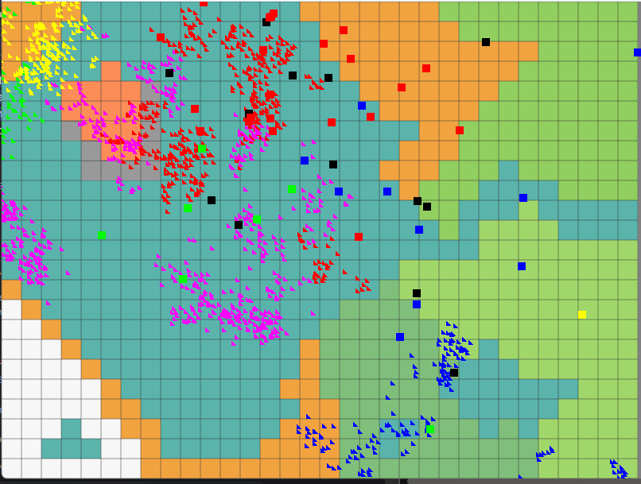

# SIMULADOR DE ECOSISTEMA

 

 

  projecto_info1123_ 
   
  Integrantes:  Cristian Emmanuel Caceres Escare  
              Yaninna Rossio Álvarez Alvarez  
  Universidad Católica de Temuco, Campus Norte  
  Sección 1  
  Fecha de entrega: 28 de noviembre 2023  

# Introducción
Para este proyecto se nos ha solicitado desarrollar un **Simulador de Ecosistemas** basado en la programación **(POO)**. Cuyo objetivo principal es poder representar, manipular, manejar diferentes biomas, eventos y la interacción de flora y fauna. En donde atreves de una matriz se realizarán dichos escenarios. 
Para crear nuestro simulador, hemos integrado un fondo de pixeles, el cual ira cambiando cada -°N- Ciclo, mostrando una especie de animación el cual ira adaptándose para previos eventos fututos.  
Por otra parte, los animales y plantas son figuras geométricas para diferenciar su especie le hemos integrado diferentes colores y forma. **Cuadrado** para los *animales* y **Triángulos** para las *plantas*. 
 
A continuación, se explicará los detalles más relevantes de este proyecto. Si usted le interesa saber más, le invitamos revisar nuestra  <a href="https://uctcl-my.sharepoint.com/:w:/g/personal/yalvarez2023_alu_uct_cl/Ebri17ahXwlHtXVQ1aO0Q3ABOmlkQvSr4JIf7c2vadMIOw">Documentación</a> que habla más ampliamente el proyecto.

# Objetivos 
Nuestros objetivos propuestos lo subdividimos en 3 secciones "Principal/Secundario/ terciario" esto para poder enmarcar nuestras prioridades a la hora de creación y explicación del simulador. 
- **Principal**:
  - Definir el diseño que tendrá en simulador
  - Asignar una matriz de 24 x35 para el ecosistema
  - Crear las características y comportamiento de los objetos que provengan de las clases principales
  - Cumplir con las funciones necesarias
  - Realizar interfaz grafica
  - Definir reglas  
- **Secundario**:
  - Realizar interfaz de los eventos catastróficos
  - Corregir bugs secundarios que no afecten tanto el código
  - Experimentar con una animación más fluida 

# Componentes del Simulador
### 1.Clases Principales
Como clases fundamentales para poder crear nuestros objetos encontramos a: 
   - *Organismo*: La clase de organismos se encarga de la estructura principal que tendrán las plantas y animales teniendo en cuenta aquellas cosas que tienen en común por lo mismo esta clase posee algunos métodos que ambas subclases heredan.
   - *Animal*: Subclase derivada de organismo la cual delimita lo que es un animal en este código dándole sus característica.
   - *Plantas*: Encargada de la generación de plantas 
Subclase derivada de organismos la cual delimita el comportamiento de las plantas y sus características principales.
   - *Ambiente*:clase encargada de generar las características de cada ambiente para su diferenciación dentro de sus características generadas esta clase es la llamada clase ecosistema que para más facilidad y comodidad de nuestra parte se decidió llamar ambiente.
   - *Ecosistema*:
### 2.Estructura de Datos
   - *Matriz Espacial*:Se creo una matriz predefinida para la mayor facilidad del manejo de los eventos y métodos de cada ser que interviene dentro del código.Es una matriz de 24x35 y esta representa el mapa de nuestro ecosistema.
   - *Motor de eventos*: Actualmente se cuenta con 3 tipos de eventos de catastrodes Terremoto, Meteoritos, Tsunami. Estos se activaran al precionar una tecla en especifica.
### 3.Funcionalidades que tiene el ecosistemas
- *Ciclo de vida*:Los animales dentro del ecosistema presentan un ciclo de vida básico donde estos se reproducen unas 3 veces y mueren dándoles un tiempo de vida algo corto a diferencia de las plantas las cuales en el momento de reproducirse mueren dejando atrás sus semillas 
- *Ciclo de reproducción*:El ciclo de reproducción presente en los animales provoca la aparición des de 0 a 2 crías las cuales tienen una demora en su tiempo de reproducción de 3 ciclos antes de habilitarse esta característica además de limitar esta para evitar que se reproduzcan con sus padres directos. 
Las plantas presentan un ciclo de reproducción asexual que después de 3 ciclos crea plantas para luego morir dejando a las otras 2 plantas ansiosas de su destino final   
- *Cadena Alimenticia*:
La cadena alimenticia se compone de las plantas como eslabón más bajo posteriormente los distintos tipos de herbívoros y finalmente los carnívoros
- *Interfaz de Usuario*:El programa presenta una interfaz lateral la cual explica a que equivale cada forma y su color dentro del programa en conjunto a las teclas de acción las cuales van del 1 al 3 estas representan los eventos que se pueden desencadenar dentro del ecosistema.
 
Puede econtrar más infomación en la <a href="https://uctcl-my.sharepoint.com/:w:/g/personal/yalvarez2023_alu_uct_cl/Ebri17ahXwlHtXVQ1aO0Q3ABOmlkQvSr4JIf7c2vadMIOw"> Documentación </a> en la pagina 7 , se explica ah detalle el **Código intero del Simulador** y como esto se ve presente en la intefaz

# Formato visual

La interfaz grafica es de una dimension de 1000x600.
El mapa presenta una dimencion de 800x600,con una matriz de 25x32. Cada cuadro del mapa mide un 25x25 pixeles y para conformar este mapa colorido se inicializo en matriz con los numeros de colores asignado, Y que más adelante este sera modificado. Los colores presenta diferentes biomas:
- Blanco: Atartica
- Verde claro 1: Bosque templado
- Verde claro 2: Bosque
- Verde oscuro: Selva
- Narajo: Decierto
- Azul: Segun su tamaño ,puede ser mar, lago,rio
- Gris: Rocas
- Rojo: Isla

 

Existen actualmente 2 eventos de catrastofes , el de Sismo o terremo y Meteoritos:  
Estos funcionan en un determinado ciclo , o tambien se les puede llamar precionado las flechas **<** izquierda( Meteorito)  **>** derecha(Sismo)  
Aca dejo un video clip de una versión temprana del evento <a href="https://youtu.be/95ZXbb3IUEc"> https://youtu.be/95ZXbb3IUEc</a> 

# Manejo de datos
- Almacenamiento: Los datos del simulador se guardan en un archivo llamado JSON

# Biblotecas utilizadas.
- Pygame: Se utilizó principalmente para mostrar una interfaz gráfica 2D y usar sus herramientas para mejor manejo de eventos.
- numpy : Esta librería se utilizó para crear la matriz de nuestro simulador que seria el mapa
- random : Generar posiciones aleatorias de los animales y plantas a la hora de ingresar el simulador
- time : Controlar el tiempo de cada ciclo

# Herramienta de programación
El **simulador de Ecosistema** fue creado con el lenguaje **Python** mediante las herramientas de **Visual Stude Code** y **Github**.

# Conclusión.
Ya dando como cierre , en este proyecto se logró comprender el uso del POO ya que este lenguaje de programación permite mostrar una simulación de ecosistema , en donde cada parte de la interfaz gráfica era un objeto que se podía manipular a través de eventos.
Aunque presentamos dificultades en su creación , logramos que muchas ideas implementadas al inicio se lograra.
